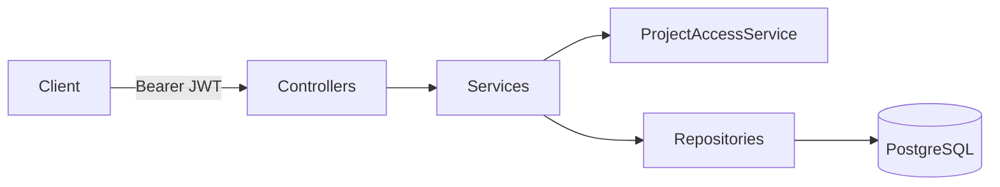

# Taskboard API

[](https://github.com/gabryelvs/taskboard-api/actions)
[](LICENSE)

Trello-like task manager REST API: projects, invite-only membership, ordered
columns and cards, comments, priorities and deadlines. Java 21 / Spring Boot 3.3.

**Live demo:** https://taskboard-gv.fly.dev/swagger-ui.html
(first request may take ~15s — the machine auto-stops when idle)

## Highlights

- **JWT auth with refresh rotation** — 15-minute access tokens; opaque refresh
  tokens stored hashed (SHA-256), rotated on every use, revocable via logout.
- **No-leak authorization** — non-members get 404 (not 403) on any
  project-scoped resource, so the API never confirms a board exists.
- **Dense position ordering** — moving a card runs one transaction that takes
  pessimistic locks on both columns, closes the gap in the source column and
  opens one in the target; positions stay 0..n-1 with no fractional-rank hacks.
- **RFC 7807 errors** — every failure is `application/problem+json`.
- **Real-database tests** — 55 integration tests against PostgreSQL via
  Testcontainers, run on every push in GitHub Actions.
- **Flyway migrations** — schema is versioned; Hibernate runs in
  `ddl-auto: validate` only.

## Architecture



| Package | Responsibility |
|---|---|
| `auth` | Register/login/refresh/logout, JWT issuing and validation, refresh-token store |
| `project` | Projects CRUD and membership (invite, remove, roles) |
| `column` | Board columns with dense position ordering |
| `card` | Cards: CRUD, cross-column filtering, transactional move |
| `comment` | Card comments with author-only edit/delete |
| `common` | Security config, project access checks (the 404-no-leak rule), RFC 7807 exception handler, OpenAPI config |

## API overview

All endpoints except `/auth/**` require a `Authorization: Bearer <accessToken>`
header. "Member" means any member of the project the resource belongs to;
requests from non-members return 404.

| Method | Path | Access |
|---|---|---|
| POST | `/auth/register` | public |
| POST | `/auth/login` | public |
| POST | `/auth/refresh` | public (valid refresh token) |
| POST | `/auth/logout` | public (revokes the refresh token) |
| GET | `/projects` | authenticated (lists your projects) |
| POST | `/projects` | authenticated (creator becomes owner) |
| GET | `/projects/{id}` | member |
| PATCH | `/projects/{id}` | owner |
| DELETE | `/projects/{id}` | owner |
| GET | `/projects/{projectId}/members` | member |
| POST | `/projects/{projectId}/members` | owner (invite by email) |
| DELETE | `/projects/{projectId}/members/{userId}` | owner |
| GET | `/projects/{projectId}/columns` | member |
| POST | `/projects/{projectId}/columns` | member |
| PATCH | `/columns/{id}` | member (rename) |
| PATCH | `/columns/{id}/position` | member (reorder) |
| DELETE | `/columns/{id}` | member |
| GET | `/columns/{columnId}/cards` | member |
| POST | `/columns/{columnId}/cards` | member |
| GET | `/projects/{projectId}/cards` | member (filter by `priority`, `dueBefore`, `assigneeId`) |
| GET | `/cards/{id}` | member |
| PATCH | `/cards/{id}` | member |
| PATCH | `/cards/{id}/move` | member (target column + position) |
| DELETE | `/cards/{id}` | member |
| GET | `/cards/{cardId}/comments` | member |
| POST | `/cards/{cardId}/comments` | member |
| PATCH | `/comments/{id}` | comment author |
| DELETE | `/comments/{id}` | comment author |

Full interactive docs at `/swagger-ui.html`.

## Run locally

Needs Java 21 and Docker.

```bash
docker compose up -d          # starts PostgreSQL 16 on :5432
./mvnw spring-boot:run        # http://localhost:8080/swagger-ui.html
```

## Run tests

```bash
./mvnw test                   # needs Docker running (Testcontainers)
```

> **Windows + Docker Desktop note:** on Docker Desktop 29 or newer,
> Testcontainers may fail to detect the daemon. If that happens, create
> `%USERPROFILE%\.testcontainers.properties` with
> `docker.host=npipe:////./pipe/dockerDesktopLinuxEngine` and
> `%USERPROFILE%\.docker-java.properties` with `api.version=1.44`.

## Example flow

```bash
# 1. Register (returns accessToken + refreshToken)
curl -s -X POST http://localhost:8080/auth/register \
  -H "Content-Type: application/json" \
  -d '{"email":"me@example.com","password":"s3cret-pass","name":"Gabryel"}'

export TOKEN=<accessToken from the response>

# 2. Create a project
curl -s -X POST http://localhost:8080/projects \
  -H "Authorization: Bearer $TOKEN" -H "Content-Type: application/json" \
  -d '{"name":"Job hunt","description":"Applications pipeline"}'

# 3. Add a column to it
curl -s -X POST http://localhost:8080/projects/<projectId>/columns \
  -H "Authorization: Bearer $TOKEN" -H "Content-Type: application/json" \
  -d '{"name":"To do"}'

# 4. Add a card to the column
curl -s -X POST http://localhost:8080/columns/<columnId>/cards \
  -H "Authorization: Bearer $TOKEN" -H "Content-Type: application/json" \
  -d '{"title":"Apply to Monzo","priority":"HIGH","deadline":"2026-08-01T09:00:00Z"}'

# 5. Move the card to another column, position 0
curl -s -X PATCH http://localhost:8080/cards/<cardId>/move \
  -H "Authorization: Bearer $TOKEN" -H "Content-Type: application/json" \
  -d '{"columnId":"<otherColumnId>","position":0}'
```

## Deploy

The included `Dockerfile` and `fly.toml` deploy to Fly.io:

```bash
fly launch --no-deploy        # or reuse the committed fly.toml
fly secrets set JWT_SECRET=<256-bit secret> DATABASE_URL=<jdbc url> \
  DATABASE_USER=<user> DATABASE_PASSWORD=<password>
fly deploy
```

Health checks hit `/actuator/health`.

## License

MIT — see [LICENSE](LICENSE).
